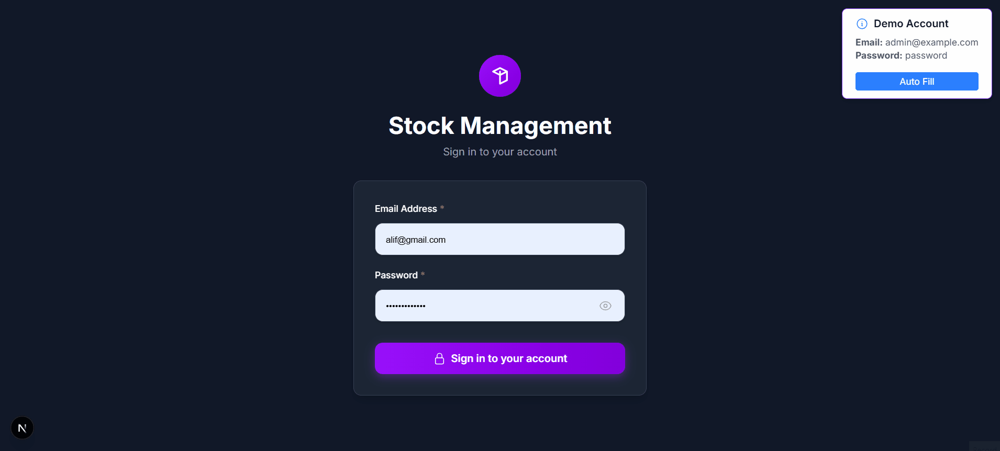

# Stock Management System v2

Modern stock management application built with Next.js and NestJS, featuring real-time inventory tracking, transaction management, and comprehensive admin dashboard.

## 👀 Preview Aplikasi



## ✨ Features

- **Modern UI**: Clean, responsive interface built with Next.js and Tailwind CSS
- **Authentication**: Secure JWT-based authentication system
- **Product Management**: Create, read, update, and delete products with categories
- **Stock Tracking**: Real-time inventory management with stock in/out transactions
- **Admin Dashboard**: Comprehensive overview with statistics and recent activities
- **Transaction History**: Complete audit trail of all stock movements
- **Image Upload**: Product image management with file upload support
- **Dark Theme**: Modern dark theme interface
- **Responsive Design**: Works perfectly on desktop and mobile devices

## 🛠️ Tech Stack

### Frontend

- **Framework**: Next.js 15.4.6
- **Language**: TypeScript
- **Styling**: Tailwind CSS 4.0
- **UI Components**: Headless UI
- **Icons**: Heroicons
- **HTTP Client**: Axios
- **Forms**: React Hook Form with Zod validation
- **Notifications**: React Hot Toast

### Backend

- **Framework**: NestJS 11.0
- **Language**: TypeScript
- **Database**: MySQL with TypeORM
- **Authentication**: JWT with Passport
- **File Upload**: Multer
- **Validation**: Class Validator & Class Transformer
- **Password Hashing**: bcrypt

### Database

- **Database**: MySQL
- **ORM**: TypeORM
- **Migration**: SQL schema files

## Prerequisites

Before you begin, ensure you have the following installed:

- **Node.js** (v18.0.0 or higher)
- **npm** or **yarn**
- **MySQL** (v8.0 or higher)
- **Git**

## 🚀 Installation & Setup

### 1. Clone the Repository

```bash
git clone https://github.com/alifsuryadi/stock-management-v2
cd stock-management-v2
```

### 2. Database Setup

#### Create Database

```bash
# Connect to MySQL
mysql -u root -p

# Create database and import schema
mysql -u root -p < database/schema.sql
```

The schema will create:

- Database: `stock_management_v2`
- Tables: `admins`, `product_categories`, `products`, `transactions`, `transaction_items`
- Sample data including default admin and sample products

#### Default Admin Credentials

- **Email**: admin@example.com
- **Password**: password

### 3. Backend Setup

```bash
# Navigate to backend directory
cd backend

# Install dependencies
npm install

# Create environment file
cp .env.example .env
```

#### Configure Environment Variables

Create `.env` file in the backend directory:

```env
# Database Configuration
DB_HOST=localhost
DB_PORT=3306
DB_USERNAME=root
DB_PASSWORD=your_mysql_password
DB_DATABASE=stock_management_v2

# JWT Configuration
JWT_SECRET=your-super-secret-jwt-key-here

# Application
PORT=3001
```

#### Start Backend Server

```bash
# Development mode
npm run start:dev

# Production mode
npm run build
npm run start:prod
```

Backend will run on: `http://localhost:3001`

### 4. Frontend Setup

```bash
# Navigate to frontend directory
cd frontend

# Install dependencies
npm install

# Create environment file
cp .env.local.example .env.local
```

#### Configure Environment Variables

Create `.env.local` file in the frontend directory:

```env
NEXT_PUBLIC_API_URL=http://localhost:3001
```

#### Start Frontend Server

```bash
# Development mode
npm run dev

# Production mode
npm run build
npm run start
```

Frontend will run on: `http://localhost:3000`

## 🎮 Usage

### 1. Access the Application

Open your browser and navigate to `http://localhost:3000`

### 2. Login

Use the demo credentials that appear in the toast notification:

- **Email**: admin@example.com
- **Password**: password

### 3. Navigate the Dashboard

- **Dashboard**: Overview with statistics and recent activities
- **Products**: Manage product inventory
- **Categories**: Organize products by categories
- **Transactions**: Record stock in/out movements
- **History**: View complete transaction history
- **Admins**: Manage system administrators

## 📝 Project Structure

```
stock-management-v2/
├── backend/                 # NestJS backend application
│   └── src/
│       ├── controllers/     # API controllers
│       ├── services/        # Business logic
│       ├── entities/        # Database entities
│       ├── dto/             # Data transfer objects
│       ├── guards/          # Authentication guards
│       ├── strategies/      # Passport strategies
│       ├── config/          # Configuration files
│       ├── uploads/         # File upload directory
│       └── package.json
│
├── frontend/                # Next.js frontend application
│   └── src/
│       ├── app/              # App router pages
│       ├── components/       # Reusable components
│       ├── contexts/         # React contexts
│       ├── lib/              # Utility functions
│       └── types/            # TypeScript definitions
│   └── package.json
│
├── database/
│   └── schema.sql           # Database schema
│
└── README.md

```

## 🧪 Testing

### Backend Tests

```bash
cd backend

# Unit tests
npm run test

# End-to-end tests
npm run test:e2e

# Test coverage
npm run test:cov
```

### Frontend Tests

```bash
cd frontend

# Lint code
npm run lint

# Type checking
npm run build
```

## 📦 Development Commands

### Backend

```bash
# Start development server
npm run start:dev

# Build for production
npm run build

# Format code
npm run format

# Lint code
npm run lint
```

### Frontend

```bash
# Start development server
npm run dev

# Build for production
npm run build

# Start production server
npm run start

# Lint code
npm run lint
```

## 🔗 API Endpoints

### Authentication

- `POST /auth/login` - Admin login

### Admin Management

- `GET /admin` - Get all admins
- `POST /admin` - Create new admin
- `GET /admin/:id` - Get admin by ID
- `PUT /admin/:id` - Update admin
- `DELETE /admin/:id` - Delete admin

### Product Categories

- `GET /product-categories` - Get all categories
- `POST /product-categories` - Create category
- `PUT /product-categories/:id` - Update category
- `DELETE /product-categories/:id` - Delete category

### Products

- `GET /products` - Get all products
- `POST /products` - Create product
- `GET /products/:id` - Get product by ID
- `PUT /products/:id` - Update product
- `DELETE /products/:id` - Delete product
- `POST /products/:id/upload` - Upload product image

### Transactions

- `GET /transactions` - Get all transactions
- `POST /transactions` - Create transaction
- `GET /transactions/:id` - Get transaction by ID

## 🤖 Security Features

- **JWT Authentication**: Secure token-based authentication
- **Password Hashing**: bcrypt for secure password storage
- **Input Validation**: Comprehensive validation using class-validator
- **File Upload Security**: Secure file handling with Multer
- **CORS Configuration**: Proper cross-origin request handling

## Deployment

### Production Build

#### Backend

```bash
cd backend
npm run build
npm run start:prod
```

#### Frontend

```bash
cd frontend
npm run build
npm run start
```

### Environment Variables for Production

Make sure to update environment variables for production:

- Use strong JWT secrets
- Configure proper database credentials
- Set appropriate CORS origins
- Use HTTPS in production

## 🤝 Contributing

1. Fork the repository
2. Create a feature branch (`git checkout -b feature/amazing-feature`)
3. Commit your changes (`git commit -m 'Add some amazing feature'`)
4. Push to the branch (`git push origin feature/amazing-feature`)
5. Open a Pull Request

## 📄 Lisensi

Project ini menggunakan **MIT License**. Silakan lihat file [LICENSE](LICENSE) untuk detail lengkap.

---

## 😵‍💫 Troubleshooting

### Common Issues

1. **Database Connection Error**

   - Ensure MySQL is running
   - Verify database credentials in `.env`
   - Check if database exists

2. **Port Already in Use**

   - Change port in backend `.env` file
   - Update frontend API URL accordingly

3. **CORS Issues**

   - Verify CORS configuration in backend
   - Check API URL in frontend environment variables

4. **File Upload Issues**

   - Ensure `uploads` directory has write permissions
   - Check Multer configuration

5. **JWT Token Issues**
   - Verify JWT secret is properly set
   - Check token expiration settings

For more help, please create an issue in the repository.
